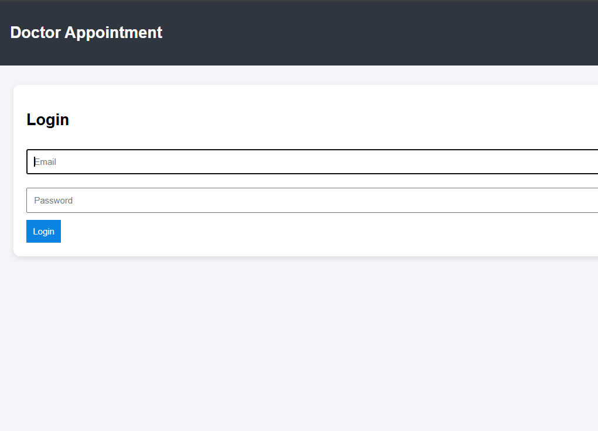

# 🏥 Doctor Appointment System

A full-stack web application that allows patients to book appointments with doctors, while doctors manage their own availability and appointments.

---

## 🚀 Features

### 👩‍⚕️ Doctor

* Register & Login
* Add available time slots (date & time)
* View patient appointments
* Approve / Reject appointments

### 🧑‍🤝‍🧑 Patient

* Register & Login
* Select hospital → doctor → slot
* Book appointment
* View appointment status

### 🏥 Admin

* Add hospitals
* Assign doctors to hospitals

---

## 🛠️ Tech Stack

### Frontend

* React.js
* Axios (API calls)
* CSS

### Backend

* Spring Boot
* Spring Data JPA
* REST APIs

### Database

* MySQL

---

## 📸 Screenshots


 
## ⚙️ How It Works

1. Doctor registers → gets a profile
2. Admin assigns doctor to a hospital
3. Doctor adds available slots
4. Patient selects hospital → doctor → slot
5. Patient books appointment
6. Doctor approves/rejects appointment

---

## 📸 Key Modules

### 🔹 Doctor Dashboard

* Add slots (date & time)
* View patient bookings
* Manage appointment status

### 🔹 Patient Booking

* Dynamic dropdown (Hospital → Doctor → Slot)
* Real-time slot availability

### 🔹 Admin Panel

* Hospital management
* Doctor-hospital mapping

---

## ▶️ How to Run

### Backend (Spring Boot)

```bash
cd Backend
mvn spring-boot:run
```

### Frontend (React)

```bash
cd frontend
npm install
npm start
```

---

## 🗄️ Database Setup

* Create MySQL database:

```sql
CREATE DATABASE doctor_appoint;
```

* Update `application.properties`:

```properties
spring.datasource.url=jdbc:mysql://localhost:3306/doctor_appoint
spring.datasource.username=YOUR_USERNAME
spring.datasource.password=YOUR_PASSWORD
```

---

## 📌 Future Enhancements

* JWT Authentication
* Email notifications
* Slot editing & deletion
* UI/UX improvements
* Search & filters
* Payment integration

---
